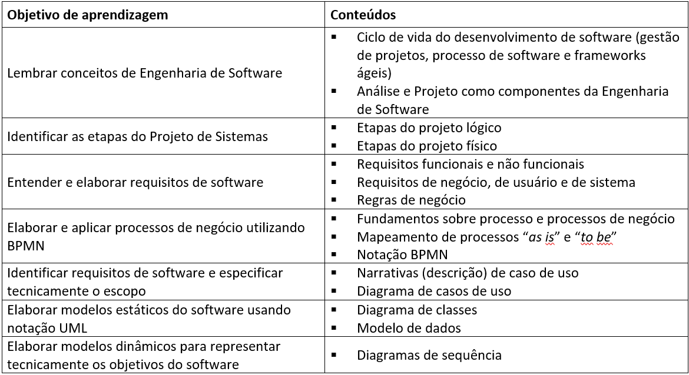
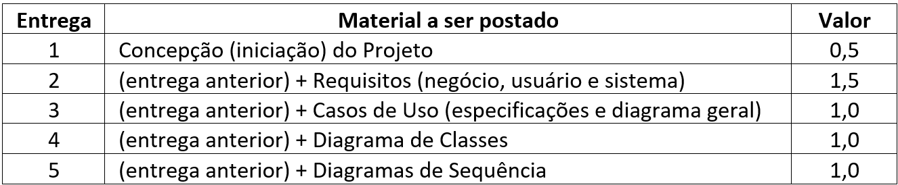

# **ANÁLISE E PROJETO DE SISTEMAS**
## Aula 1
### Apresentação da Disciplina
#### Felipe Marx Benghi
fbenghi@up.edu.com
https://github.com/fbenghi/AnaliseProjetos2024-1

---

## Objetivos
[ ] Conhecer o professor
[ ] Conhecer a turma
[ ] Entender a ementa da disciplina
[ ] Bibliografia
[ ] Combinados (provas, trabalhos)

---
## Prof. Felipe Marx Benghi
#### Formação 
- [2010-2016] Engenharia Eletrônica (UTFPR)
- [2018-2020] Mestrado em Computação Aplicada (UTFPR)

#### Experiência profissional
- [2016-2018] Web/Mobile em startup de pagamentos (Dim Dim)
- [2018-2021] Software Embarcado (Progress Rail)
- [2021-Atual] Supervisor de Software (Progress Rail)

---

---
## Turma
* Quem já trabalha com TI? 
* Qual a experiência com gestão de projetos de Software?
* Quais as ferramentas de gestão de projetos vocês já utilizaram
* Qual sua expectativa quanto a disciplina?

---
# Ementa
> Criação de modelos representativos e da documentação que engloba a construção de projetos de software, visando a elicitação de requisitos e a definição das regras de negócio que definem a produção desses projetos.

Importante:
* Não vamos fazer código!!!
* Vamos aprender a planejar como software será (funcionalidades e características)

---

---
# Extra
* Scrum Master - Opção de carreira para quem não quer programação
    https://www.scrum.org/professional-scrum-certifications/professional-scrum-master-assessments

    https://www.exin.com/pt-br/

---
# Bibliografia
MASCHIETTO, Luís Gustavo et al. Processos de desenvolvimento de software. [recurso eletrônico]. Porto Alegre: SAGAH, 2020. ISBN 978-65-5690-052-0. Disponível em: https://biblioteca-a.read.garden/viewer/9786556900520/0. Acesso em: 18 Nov 2023.
* Processos de desenvolvimento (ágil e tradicional)
* Modelos estáticos do software

---
# Bibliografia
Engenharia de requisitos: software orientado ao negócio. Rio de Janeiro: Brasport, 2016. 302 p. ISBN 978-85-745-2790-1.
* Entender e elaborar requisitos de software
* Casos de uso

---
# Ferramentas 
## Github
https://github.com/fbenghi/AnaliseProjetos2024-1

---
# Combinados
* Provas
* A1: 24 a 28/06
* A2: Trabalho contínuo
* AF: 08 a 12/07

---
# A2 - Trabalho Contínuo
* Planejar um projeto de software
* Grupos de 4 a 6 pessoas (trabalho aumenta com número de integrantes)
* Pode usar o GitHub (não é obrigatório)
* Combinaremos o prazo de entrega (+- 2 semanas após aula)

---
# Cronograma (blackboard)

---
# Fim
