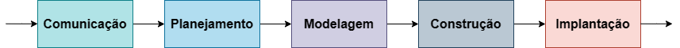
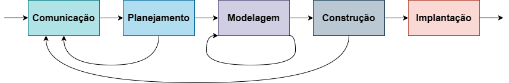
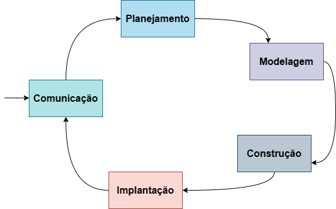
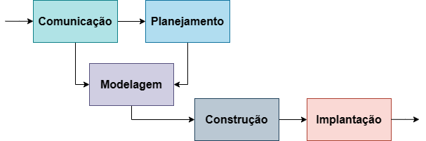
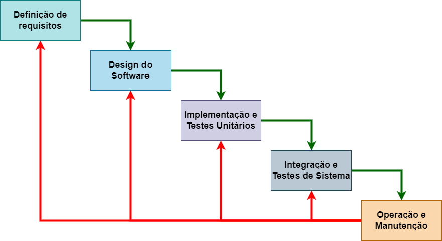
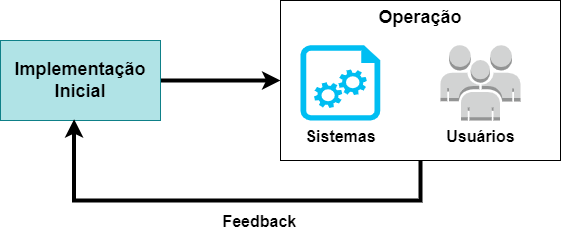
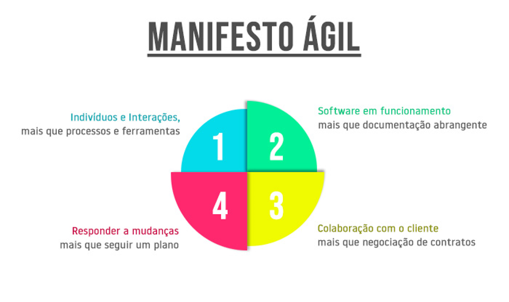
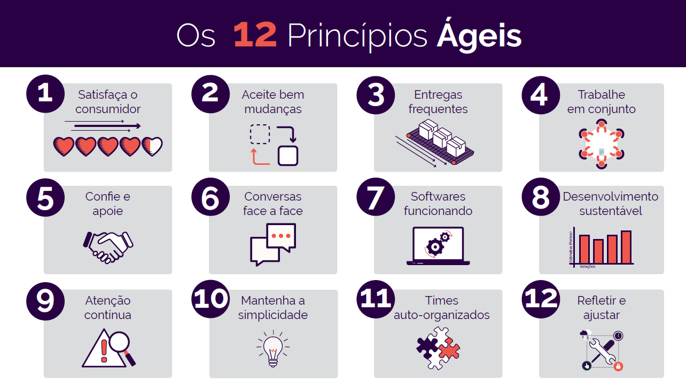
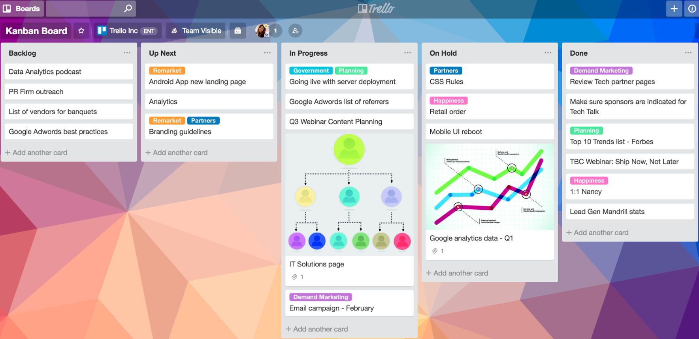

# **ANÁLISE E PROJETO DE SISTEMAS**
## Aula 3
### Fundamentos de Engenharia de Software
#### Felipe Marx Benghi
fbenghi@up.edu.com

---

# Objetivos
- [ ] Ciclo de Vida / Processo de Software
- [ ] Modelo Clássico (Cascata)
- [ ] Métodos Ágeis
    - [ ] Scrum
    - [ ] Kanban

--- 
# Ciclo de vida de desenvolvimento / processo de software
* Conjunto de atividades relacionadas que culminam na produção de um produto de software
* São COMPLEXOS - várias etapas, muitas decisões
* Não existe um processo ideal e a maior parte das empresas adapta/cria o seu próprio processo

---
## Processo de Software vs Engenharia de Software
* **Processo de Software**: estrutura para as atividades, ações e tarefas necessárias para construir software de alta qualidade. 

* **Engenharia de Software**: abrange o processo de software e tecnologias usadas nesse o processo – técnicas e ferramentas automatizadas.

---
## Processo genérico de desenvolvimento de software
* Comunicação: início do projeto e elaboração de requisitos
* Planejamento: estimativa de recursos (tempo, orçamento, pessoal) e cronograma
* Modelagem: análise e design
* Construção: codificação e testes
* Implantação: entrega, suporte e feedback

---
## Fluxo de Processo
* Linear

* Iterativo

---
## Fluxo de Processo
* Evolucionário

---
## Fluxo de Processo
* Paralelo

---
# Cascata (Waterfall) 

---
## Cascata (Waterfall) 
* Primeiro modelo publicado de Processo de Desenvolvimento de Software e derivado do processo de desenvolvimento de sistemas (Royce, 1970)
* Processo orientado ao planejamento - primeiro Planejar e Organizar, depois Implementar
* Uma fase não deve começar antes da conclusão da anterior
* Resultado de cada fase é um ou mais documentos *aprovados*

---
## Cascata - Etapas do Desenvolvimento
1. Especificação de Requisitos (o que): 
    * Compreensão e definição das serviços necessários do software
    * Identificação de restrições
1. Design (como):
    * Descrição dos componentes do software, como algoritmos, estruturas de dados
    * Definição de interfaces

---
## Cascata - Etapas do Desenvolvimento
3. Implementação (codificação) e Testes Unitários
    * Programação, conversão das especificações em código executável
    * Testes de pequenas porções do código
1. Integração 
    * Pequenos fragmentos de código são passam a ser usados e testados em conjunto
1. Testes de Sistema (Validação)
    * Garante-se que os requisitos foram alcançados

---
## Cascata - Etapas do Desenvolvimento
6. Operação e Manutenção
    * Software é instalado e colocado em uso
    * Ajustes podem ser necessários
    
---
## Cascata - Modelo V 
Variação do modelo em Cascata (waterfall)

---
## Cascata - Problemas

* Na prática, as etapas de desenvolvimento acabam se sobrepondo. Por exemplo:
    * Na arquitetura, podem ser encontrados problemas de requisitos
    * Nos testes, podem ser encontrados problemas de implementação e arquitetura

=> Documentos de etapas anteriores precisam ser revisados/atualizados para corrigir os problemas encontrados, o que implica em uma nova revisão/aprovação (trabalhoso)

---
## Cascata - Problemas
*  Para reduzir o número de iterações, documentos frequentemente são congelados, o que implica em: 
    * Problemas deixados de lado para solução futura
    * Inadequação aos problemas do usuário
    * Problemas de design

---
## Cascata - Aplicação
Setores com baixa tolerância a erros ou ciclos de vida mais longo
* Indústria Pesada
* Medicina
* Aeroespacial
* Militar

---
# Processo Incremental
Busca a evolução do software através de sucessivas iterações

* Mais adequado para a MAIOR parte dos negócios, como e-commerce e sistemas pessoais.
* Parte fundamental das **Abordagens ÁGIL**

---
## Processo Incremental - Vantagens
Benefícios em relação ao modelo cascata:
1. Menor custo para suportar mudanças
1. Mais fácil de obter um feedback do cliente
1. Produto mais rápido em operação

---
# Metodologia Ágil
> Estamos descobrindo maneiras melhores de desenvolver
fazendo-o nós mesmos e ajudando outros a fazerem o mesmo.

* É uma filosofia, não um processo.
* Não tem regras a seguir.
* Exemplos de Frameworks: Scrum, Kanban, EXtreme Programming (XP)

---

---

---
## Scrum
Framework de metodologia Ágil.
* Organiza o trabalho em ciclos curtos ou **sprints** - normalmente 2 a 4 semanas
* Possui um objetivo bem definido
* **Não devem ser feitas mudanças que coloquem em perigo o objetivo da sprint**

---
### Scrum - Quem é quem:
* Scrum master: técnico do time, repassa as regras, dá o direcionamento.
* Product Owner: gerencia do backlog e garante o valor do produto entregue ao cliente 
* Time de desenvolvimento: Programadores

---
### Scrum - Artefatos:
* Reunião diária:     
    * Objetivo: planejar e organizar as próximas 24h
    * Duração: até 15 minutos 
* Revisão da Sprint
    * Revisão do PO ou cliente do que foi entregue
    * Até 4 horas
* Retrospectiva da Sprint
    * Time avaliar a sprint e criar um plano de melhoria
    * Até 3h
---
### Scrum - Ciclo

---
## Kanban
* Framework de metodologia Ágil.
* "Kanban" é a palavra japonesa para "sinal visual"
* Um quadro de **kanban** é uma ferramenta para ajudar na visualização do trabalho a ser feito e limitar o trabalho em andamento.

---

---

# Fim!