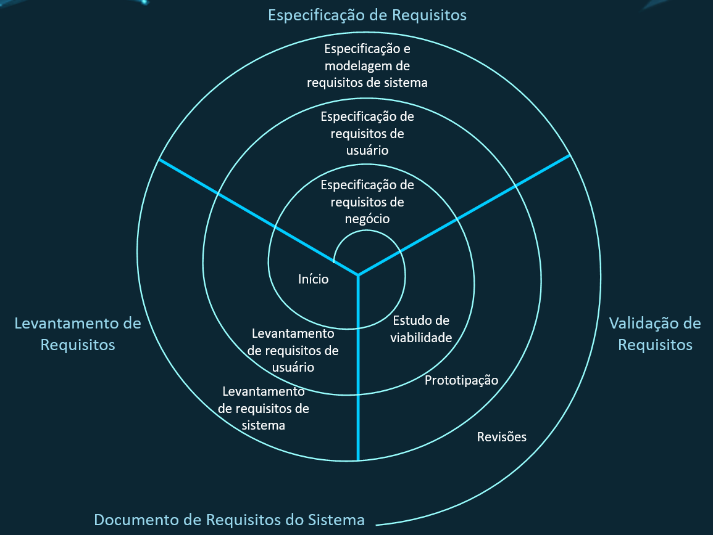
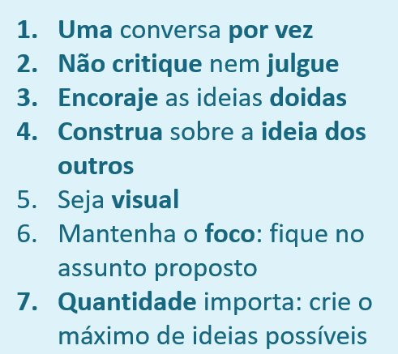
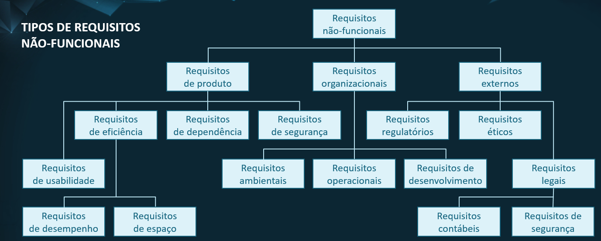
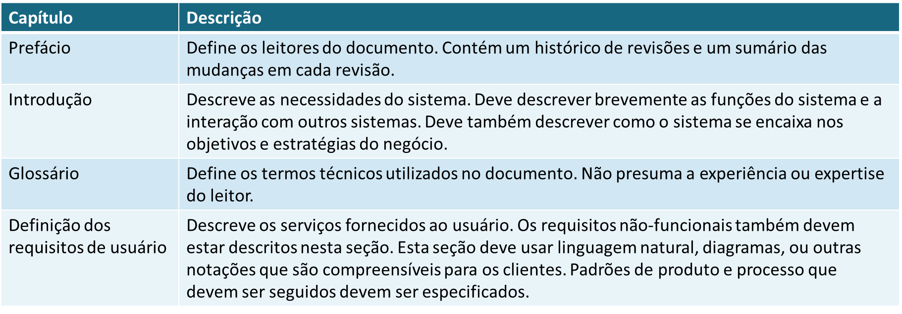
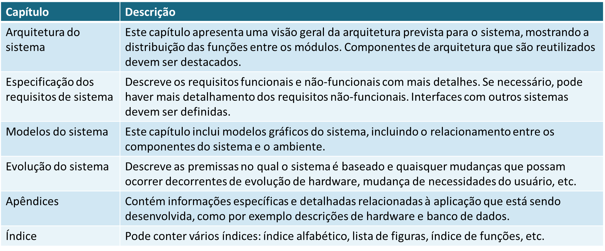

# **ANÁLISE E PROJETO DE SISTEMAS**
## Aula 5
#### Felipe Marx Benghi
Engenharia de Requisitos
fbenghi@up.edu.com
https://github.com/fbenghi/AnaliseProjetos2024-1

---

# Objetivos
* Requisitos e Engenharia de Requisitos
* Diferentes Perspectivas

---
# Por que falar sobre requisitos?

Karl Wiegers: 
> Se você não identifica os requisitos certos, não importa quão bem você execute o resto do projeto.

Peter Drucker:
> Não há nada tão inútil quanto fazer eficientemente o que não deveria ser feito.

---
## Requisitos
Necessidade física ou funcional que um projeto/produto precisa satisfazer

## Engenharia de Requisitos
Disciplina da Engenharia de Software que consiste no uso sistemático e repetitivo de técnicas para cobrir atividades de obtenção, documentação e manutenção de um conjunto de requisitos para software que atendam aos objetivos de negócio e sejam de qualidade

---

## Perspectivas da Engenharia de Requisitos
> Perspectiva: ponto de vista ou modo como alguém concebe ou analisa uma situação específica.

1. Negócio
1. Usuário
1. Sistema

---
### Perspectiva de Negócio
É o que o sistema deve conter para atender às necessidades do negócio;

* Evidencia o modo como o software irá contribuir no negócio
* Permite descobrir quais papéis são desempenhados nos macroprocessos incluídos no escopo. 
* Determinar responsabilidades de partes interessadas 
* Quais são os  objetivos de nível mais alto e que produtos ou serviços são gerados.

Ferramenta: modelagem de negócio (BPMN)

---
## Perspectiva de Usuário

* Serviços que se espera que o sistema forneça aos usuários e as restrições sob as quais ele deve operar.

--- 
## Perspectiva de Sistema
* Descrições detalhadas das funções, serviços e restrições operacionais do sistema de software. 
* O documento de requisitos do sistema (às vezes chamado de especificação funcional) deve definir exatamente o que será implementado. 
* Pode fazer parte do contrato entre o comprador do sistema e os desenvolvedores de software.

---
## Exemplo:
Requisito de negócio
> Controlar os gastos com medicamentos em uma rede de clínicas. 

Requisito de Usuário
1. O Sistema deve gerar mensalmente relatórios mostrando o custo dos medicamentos prescritos por cada clínica durante aquele mês.

---
Requisitos de Sistema

1.1 O Sistema deve gerar automaticamente o relatório de medicamentos prescritos às 17.30 do último dia útil de cada mês.
1.2 O relatório deve conter um resumo com todos os medicamentos prescritos, custo individual e custo total.
1.3 O relatório deve conter uma seção específica por clínica, em que deve ser apresentada uma lista com os nomes dos medicamentos, o total número de prescrições e o custo total
1.4. Se os medicamentos prescritos existirem em diferentes dosagens (e.g. 10 mg, 20 mg), cada dosagem deve ser listada com um medicamento diferente.
1.5 O acesso a todos os relatórios deve ser restrito a gerentes

---
## Etapas da Engenharia de Requisitos
* Levantamento de Requisitos;
* Especificação de Requisitos;
* Validação de Requisitos.

--- 

---
# Levantamento de requisitos
Podem ser aplicadas técnicas como:
* Entrevista;
* Brainstorming;
* Questionário;
* Observação Direta;
* Análise de Documentos

---
## Levantamento de Requisitos - Entrevista
* É uma das técnicas tradicionais mais simples de utilizar e que produz bons resultados na fase inicial de obtenção de dados;
* É indicada para **pequeno número de envolvidos**;
* Convém que o entrevistador dê margem ao entrevistado para expor as suas ideias;
* É necessário ter um **plano de entrevista** para que não haja dispersão do assunto principal e a entrevista fique longa;
* Deve ser conduzida em ambiente informal e de confiança mútua.

---
## Levantamento de Requisitos - Brainstorming
* Técnica para **geração de ideias**;
* Uma ou várias reuniões que permitem que as pessoas sugiram e explorem ideias.

---
## Levantamento de Requisitos - Questionário
* O uso de questionário é indicado, por exemplo, quando há **diversos grupos de usuários** que podem estar em diversos locais diferentes do país;
* Elaboram-se pesquisas específicas de acompanhamento com usuários selecionados, que a contribuição em potencial pareça mais importante, pois não seria prático entrevistar todas as pessoas em todos os locais;
* Pode ser com perguntas abertas ou fechadas.

---
## Levantamento de Requisitos - Observação direta
* Consiste em observar a rotina do departamento/empresa/setor/pessoa;
* É necessário autorização prévia;
* Importante obter informações preliminares para não atrapalhar a rotina.

---
## Levantamento de Requisitos - Análise de documentos
Consiste na análise de documentos existentes como:
* Registros;
* Cadastros;
* Relatórios;
* Outros documentos relevantes.

---

# Especificação de Requisitos

---
## Classificação de Requisitos
### Requisitos funcionais
* São as declarações de serviços que o software deve fornecer, como o software deve reagir a entradas específicas e como o software deve se comportar em determinadas situações.
* Em alguns casos, os requisitos funcionais podem também estabelecer explicitamente o que o software não deve fazer.

---
### Requisitos funcionais
Exemplos:
* O software deve possibilitar o cálculo dos gastos diários, semanais, mensais e anuais com pessoal.
* O software deve emitir relatórios de compras a cada quinze dias.
* Os usuários devem poder obter o número de aprovações, reprovações e trancamentos em todas as disciplinas.

---

## Classificação de Requisitos
### Requisitos Não-Funcionais
* São restrições sobre os serviços ou as funções oferecidas pelo software. 
* Incluem restrições de timing, restrições sobre o processo de desenvolvimento e padrões.
* Os requisitos não-funcionais aplicam-se frequentemente ao software como um todo.

---
### Requisitos Não-Funcionais

---
### Requisitos Não-Funcionais
Exemplos:
* A base de dados deve ser protegida para acesso apenas de usuários autorizados.
* O tempo de resposta do sistema não deve ultrapassar 30 segundos.
* O software deve ser compatível com o sistema Linux.

---

## Documento de requisitos do sistema
* O documento de requisitos de software é a declaração oficial do que os desenvolvedores de sistema devem implementar;
* Deve incluir os requisitos de negócio, os requisitos de usuário e uma especificação detalhada dos requisitos do sistema;
* Em alguns casos, os requisitos de usuários e de sistema podem estar integrados em uma única descrição.

---

---

---
## Especificação de requisitos

É o processo de registrar os requisitos de negócio, usuário e sistema em um documento, em uma linguagem:
* Clara e não-ambígua;
* Correta;
* Consistente;
* Confiável
* Completa;
* Compreensível;
* Concisa;

---

## Boas práticas para Escrever requisitos
* Defina um formato: 
    Exemplo: `Alguém` deve `fazer algo` `em certas condições`
* Use Frases curtas
* Garanta que é verificável/testável
* Use os mesmos nomes para as mesmas coisas
* Não detalhe a implementação
* Não use adjetivos fracos (eficiente, amigável, confiável, poucos, rápido)
* Não use voz passiva

---
## Exemplos de Requisitos Mal-Escritos
> A aeronave deve ser aprimorada para proteger a tripulação de uma grande força de impacto. 

> A operação e a localização de todos os controles manuais do acelerador devem ser intuitivas para ambos os membros da tripulação

---
## Especificação dos requisitos
A partir daqui, iremos especificar os requisitos sob as três perspectivas:
* Negócio: mapeamento de processos de negócio (BPMN);
* Usuário: estórias de usuário (user stories);
* Sistema: especificação detalhada dos requisitos.

---
# Validação de Requisitos

* É o processo de verificar se os requisitos definem o sistema que o cliente realmente quer;
* Acontece junto com o levantamento e análise, pois o objetivo é identificar problemas com os requisitos;
* É um processo extremamente importante, pois erros nos requisitos podem levar a retrabalho e aumento de custo.
* Os requisitos especificados devem ser validados constantemente em um trabalho conjunto que envolve os analistas e o cliente (usuário);

---
## Validação de Requisitos - O que verificar?

* Verificação de completude: o documento deve conter os requisitos que definem todas as funções e restrições apontadas pelo usuário;
* Verificação de realismo: sabendo das tecnologias existentes, deve-se garantir que os requisitos podem ser implementados com o orçamento disponível e destinado ao projeto;
* Verificação de verificabilidade: para evitar problemas entre cliente e fornecedor, os requisitos devem ser descritos de forma que possam ser verificados se estão atendendo às necessidades.

---
## Validação de Requisitos - Técnicas
* Revisões de requisitos: os requisitos são sistematicamente analisados por uma equipe para detectar erros e inconsistências;
* Prototipação: envolve a construção de um protótipo executável do sistema para avaliar se atende às expectativas do usuário;
* Geração de casos de teste: os requisitos devem ser testáveis; se há dificuldade na criação de casos de teste, normalmente indica que os requisitos são difíceis de implementar e devem ser reconsiderados.

---
# FIM