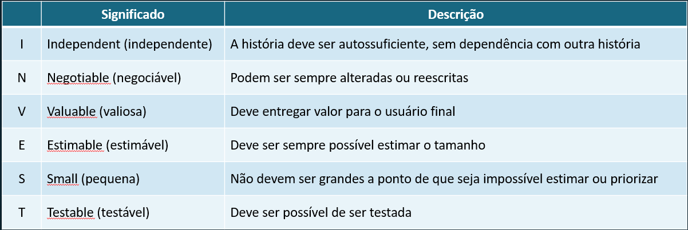
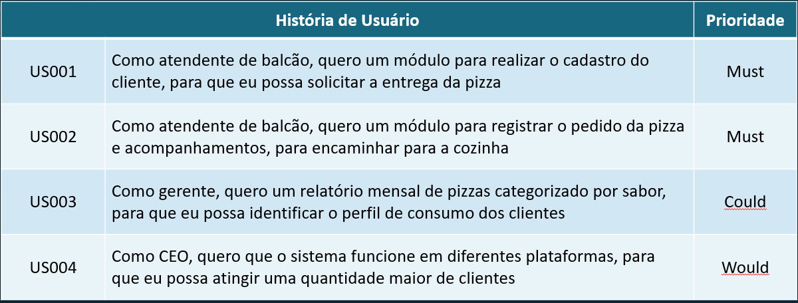
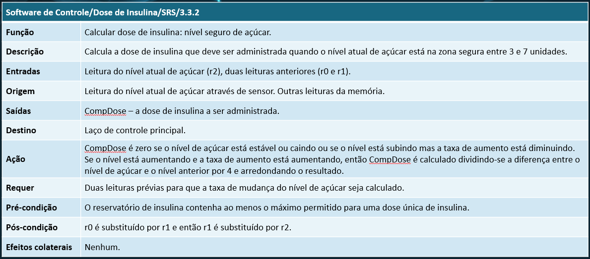
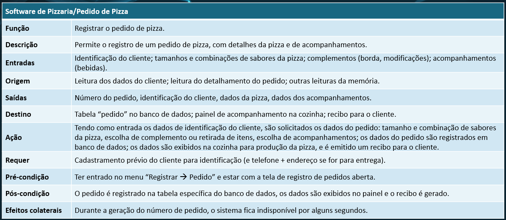
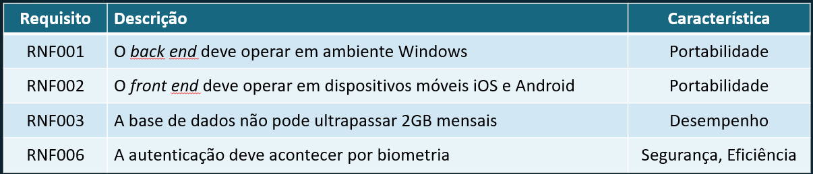

# **ANÁLISE E PROJETO DE SISTEMAS**
## Aula 6
#### Felipe Marx Benghi
Requisitos de Usuário e de Sistema
fbenghi@up.edu.com
https://github.com/fbenghi/AnaliseProjetos2024-1

---

# Objetivos
* Linguagem Natural Estruturada
    * Requisitos de usuário
    * Requisitos de sistema

---
# Engenharia de Requisitos
## Linguagem Natural Estruturada
* Requisitos são escritos de maneira padronizada. Exemplo:
    `Alguém` deve `fazer algo` `em certas condições`
* Limita a liberdade do redator de requisitos

Vantagens:
* Mantém grande parte da expressividade e compreensibilidade da linguagem natural
* Garante que alguma uniformidade seja imposta à especificação

---
## Linguagem Natural Estruturada
Iremos especificar os requisitos sob as três perspectivas:
* Negócio: BPMN
* Usuário: histórias de usuário (user stories);
* Sistema: especificação detalhada dos requisitos.

---
## História do usuário
* Afirmação sobre o que o usuário quer fazer com uma característica de software, escrito na perspectiva de um usuário;
* Não deve conter termos técnicos ou objetivos do projeto - linguagem de negócios compreensível a todos;
* Concentra-se em quem, o quê e o porquê de um recurso, não como.

---
## História do usuário
Deve responder a 3 perguntas:
* Quem se beneficia? 
    * Parte interessada que se beneficia da história do usuário (ator).

* O que se quer? 
    * Visão alto nível da funcionalidade para o usuário (descrição).

* Qual é o benefício? 
    * Valor de negócio que a história proporciona (porquê)

---
## História do usuário
Formato sugerido: Como `papel`, eu quero `algo` para `me beneficiar`.

*  Como cliente, quero consultar o catálogo, para que eu possa encontrar o produto que desejo comprar.

* Como vice-presidente de vendas, eu quero rever o desempenho histórico de vendas, para identificar regiões geográficas e produtos de melhor desempenho.

* Como CEO, quero que o sistema funcione em diferentes plataformas, para que eu possa atingir uma quantidade maior de clientes.

---
## História do usuário
Alguns cuidados:
* Manifestar objetivos de pequena granularidade que permitam a estimativa do investimento na entrega do software correspondente sem perder uma visão dos resultados associados.
* Não aborda explicitamente como documentar requisitos não funcionais.
* Pode não ser adequada para ambientes mais burocráticos ou quando o nível de documentação do projeto é imposto.

---
## História do usuário - Critérios de qualidade
Modelo 3Cs – Card, Conversation, Confirmation

* Cartão: 
    * Pequena o suficiente para caber em um cartão?
* Conversação: 
    * Promove a comunicação entre o usuário e o time?
    * Proporciona um entendimento comum da funcionalidade?
* Confirmação: 
    * Consta qual o comportamento esperado para confirmar o seu escopo ou o plano de teste?

---
## História do usuário - Critérios de qualidade
Critério INVEST, proposto por Bill Wake em 2003:

---
## História do usuário - Prioridade
Análise MoSCoW: define a prioridade para a próxima entrega:
* Must have [deve ter]: necessária
* Should have [deveria ter]:  desejável, esperada
* Could have [poderia ter]: desejável, não esperada
* Would have [teria]: fora de escopo

---
## História do usuário - Prioridade

---
# Requisitos de Sistema

* Descrições mais detalhadas das funções, serviços e restrições operacionais do sistema de software. 
* O documento de requisitos do sistema (às vezes chamado de especificação funcional) deve definir exatamente o que será implementado. 
* Ele pode fazer parte do contrato entre o comprador do sistema e os desenvolvedores de software
* Requisitos funcionais e não-funcionais

---
## Requisitos Funcional - Detalhado
Segundo SOMMERVILLE (2016, p. 123), um formato padrão usando linguagem estruturada deve conter os seguintes itens:
* Função ou entidade que está sendo especificada;
* Entradas e origens dessas entradas;
* saídas e destinos dessas saídas;
* Ação a ser tomada;
* Informações necessárias;
* Pré-condições e pós-condições para completar a ação;
* Descrição dos efeitos colaterais.

---
## Requisitos Funcional - Detalhado

---
## Requisitos Funcional - Detalhado

---
## Requisitos Não-Funcional

Formato adotado na disciplina:

`Alguém` deve `fazer algo` `em certas condições`

---
## Requisitos Não-Funcional Tipos

---
## Requisitos Não-Funcional - Métricas
* Velocidade        
    * Transações processadas por segundo    
    * Tempo de resposta do usuário/evento   
    * Tempo de atualização da tela          
* Tamanho           
    * Megabytes (Mbytes)                     
    * Número de chips ROM                 

---
## Requisitos Não-Funcional - Métricas  
* Facilidade de uso 
    * Tempo de treinamento                  
    * Número de quadros de ajuda     
* Confiabilidade    
    * Tempo médio até a falha               
    * Probabilidade de indisponibilidade    
    * Taxa de ocorrência de falhas          
    * Disponibilidade             

---
## Requisitos Não-Funcional - Métricas          
* Robustez          
    * Tempo para reiniciar após falha       
    * Porcentagem de eventos de falha
    * Probabilidade de corrupção de dados 
* Portabilidade
    * Sistemas de destino          

---
## Requisitos Não-Funcional - Exemplos       

---
# FIM