# **ANÁLISE E PROJETO DE SISTEMAS**
## Aula 7
#### Felipe Marx Benghi
Modelagem de Requisitos - Casos de Uso
fbenghi@up.edu.com
https://github.com/fbenghi/AnaliseProjetos2024-1

---

# Objetivos
* Modelagem de Requisitos
* Casos de Uso
    * Diagrama UML

---
## Modelo
Segundo FLUXO (2016):
>Um modelo nada mais é do que uma representação simplificada da realidade.

---
## Modelagem de Requisitos
- Leva à **especificação dos requisitos** e à **representação técnica do software** a ser construído
- Fornece ao desenvolvedor e ao cliente os **meios para avaliar a qualidade** uma vez que o software é construído
- Preenche a **lacuna entre** uma descrição em **nível de sistema** e um **design de software** que descreve a arquitetura de aplicação do software, interface do usuário e estrutura em nível de componente.

---
## Cascata - Modelo V 
Variação do modelo em Cascata (waterfall)

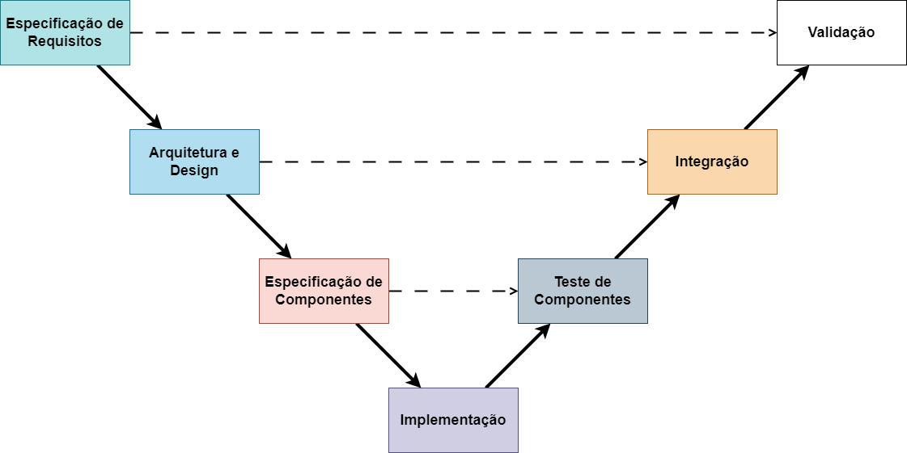

---
### Tipos de modelagem
* Modelos Baseados em Cenário: 
Como o **usuário interage** com o sistema e a **sequência específica** de atividades que ocorrem à medida que o software é utilizado. 

* Modelos comportamentais: 
Como **eventos externos mudam o estado do sistema** ou das classes que residem dentro dele. 

---
### Tipos de modelagem

* Modelos de fluxo: 
Representam o sistema como uma **transformação de informação**, retratando como objetos de dados são transformados à medida que fluem através das várias funções do sistema.

* Modelos baseados em classes: 
**Objetos** que o sistema manipulará, as **operações** que serão aplicadas aos objetos para efetuar a manipulação, **relações** (algumas hierárquicas) entre os objetos e as colaborações que ocorrem entre as classes que são definidas. 

---
## Tipos de modelagem
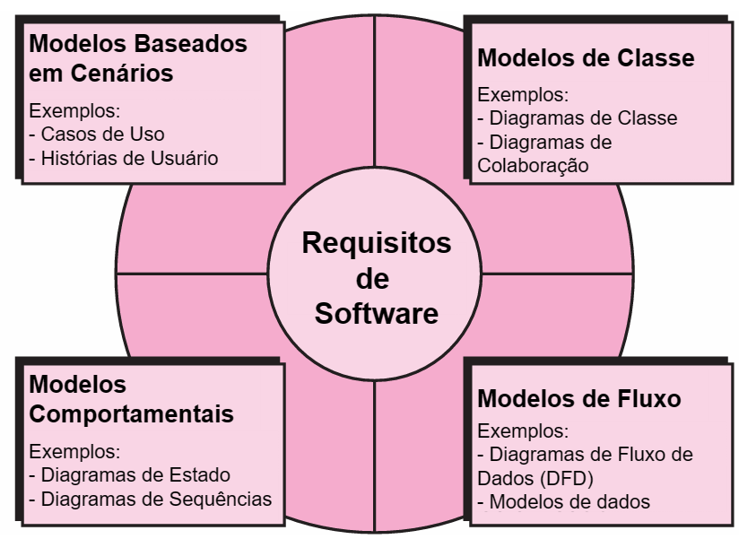

---
## Modelos baseados em cenário - Casos de uso
* Identificam as interações individuais entre o sistema e seus usuários ou outros sistemas.
* Conta uma história estilizada sobre como um usuário final (desempenhando um dos vários papéis possíveis) interage com o sistema sob um conjunto específico de circunstâncias.

- É baseado nos requisitos funcionais, podendo:
    - Um requisito funcional se desmembrar em mais de um caso de uso;
    - Mais de um requisito funcional ser fundido em um único caso de uso.

---
## Casos de uso
Exemplos de caso de uso:
* Cadastrar cliente;
* Agendar consulta;
* Efetivar matrícula.

Representado principalmente por:
* Narrativa (especificação) de caso de uso (textual);
* Diagrama de casos de uso (diagrama).

---
## Diagrama de Casos de Uso
* É a representação gráfica (diagramática) dos casos de uso do sistema, suas dependências e derivações;
* Notação UML (Unified Modeling Language – Linguagem de Modelagem Unificada).

---
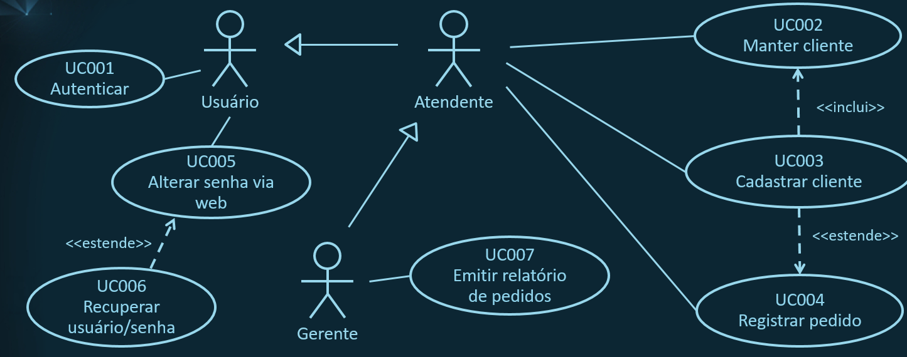

---
## Diagrama de Casos de Uso
Em um diagrama de caso de uso são representados:
* Atores;
* Casos de uso;
* Relações.

---
## Diagrama de Casos de Uso
### Atores
* Usuário ou perfil de usuário do sistema.
    * Atores e usuários podem não ser iguais
    * Um usuário pode ter vários "papeis"
* Representado por um avatar e um rótulo com o nome do ator logo abaixo do avatar.

---
## Diagrama de Casos de Uso
### Caso de uso
* Define uma funcionalidade macro do sistema.
* É representado por um elipse, com o nome da funcionalidade dentro do elipse.
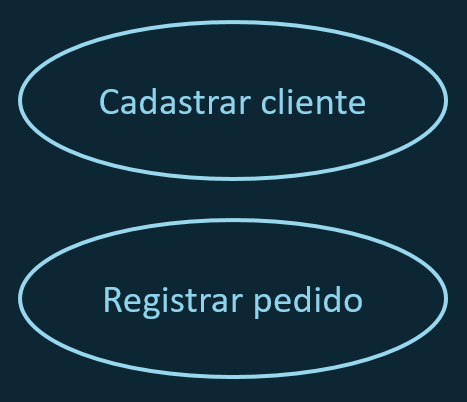

---
## Diagrama de Casos de Uso
### Relacionamento
Representa a relação entre os componentes do diagrama;
São possíveis as seguintes relações:
* Uso: Ator x Caso de Uso
* Generalização: Ator x Ator
* Inclui/Estende: Caso de Uso x Caso de Uso

---
## Diagrama de Casos de Uso
### Relacionamento - USO

Quando um ator executa um caso de uso.
* Representado por uma linha contínua simples, sem seta.
Exemplo: O ator `Atendente` executa o caso de uso `Registrar pedido`.
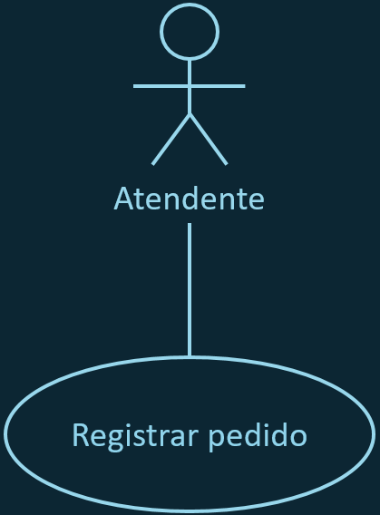

---
## Diagrama de Casos de Uso
### Relacionamento - GENERALIZAÇÃO
Quando casos de uso de um ator também são de outro Ator.

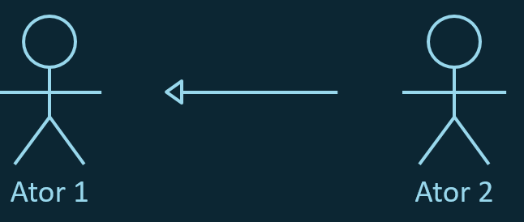

---
### Relacionamento - GENERALIZAÇÃO
O Gerente herda os casos de uso do Atendente. Isto significa que:
* O Atendente pode Registrar pedido (seu caso de uso específico), mas não pode Emitir relatório de pedidos;
* O Gerente pode Emitir relatório de pedidos (seu caso de uso específico) e, por herança, pode também Registrar pedido.

---
## Diagrama de Casos de Uso
### Relacionamento - Inclui
Quando a execução de um caso de uso é essencial para a execução de outro.

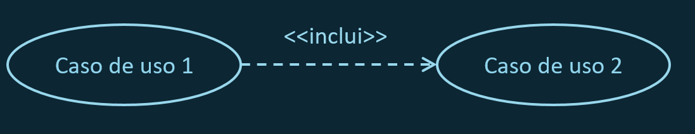

---
## Diagrama de Casos de Uso
### Relacionamento - Inclui
* Cancelamento da compra inclui o `Estorno do Pagamento`

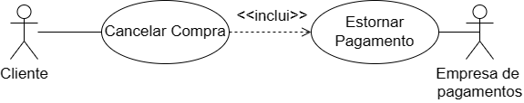

---
## Diagrama de Casos de Uso
### Relacionamento - Estende
Quando a execução de um caso de uso opcionalmente deriva para outro caso de uso, mas não necessariamente.
* Na situação a seguir, a execução do Caso de uso 1 pode ou não derivar para a execução do Caso de uso 2.

---
## Diagrama de Casos de Uso
### Relacionamento - Estende

* `Servir vinho` estende a funcionalidade `Servir Comida`. O Garçon pode servir só comida mas, opcionalmente, pode `Servir Vinho`

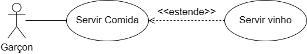

---

### Relacionamento

---
## Exemplo - Sistema de Check-In

Um sistema de check-in the bagagens permite check-in individual aos passageiros e coletivo para guias turísticos. Um check-in coletivo é composto de vários check-ins individuais. Ao realizar o check-in individual, também pode-se optar pelo despacho de bagagens.

---
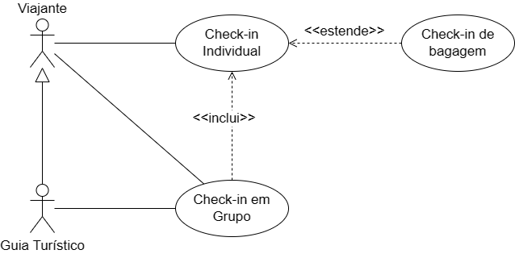

--- 
### Exemplo - Sistema de agência de viagens

O Sistema deve permitir que agentes de viagem reservem passagens aéreas para seus clientes. Fica a cargo do Agente de Viagens entregar os bilhetes de viagem aos clientes. Ao ser notificada da reserva da viagem, cabe a companhia garantir a disponibilidade dos assentos para o vôo. 

Ao se reservar uma passagem aérea, também é possível reservar um tour no destino. Optando-se pela realização de um tour, um guia local deve fazer os agendamentos de passeios.

Ao realizar-se o pagamento da viagem (passagem aérea e tour), todos os fornecedores devem ser pagos.

---
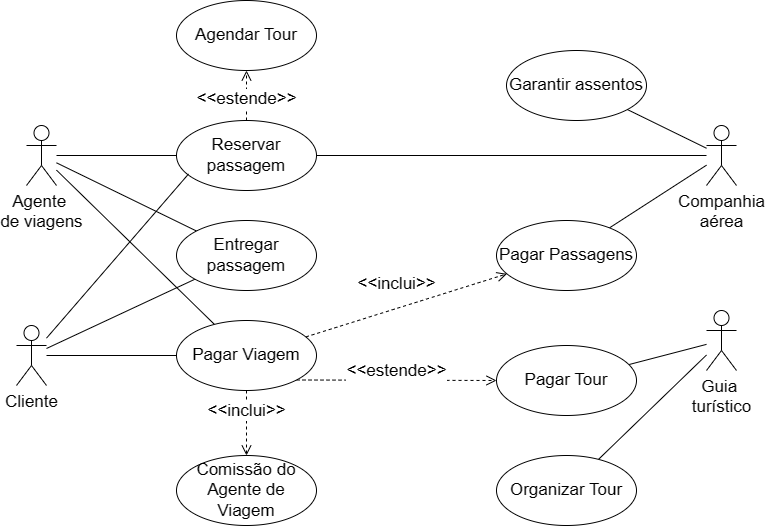

---
# FIM