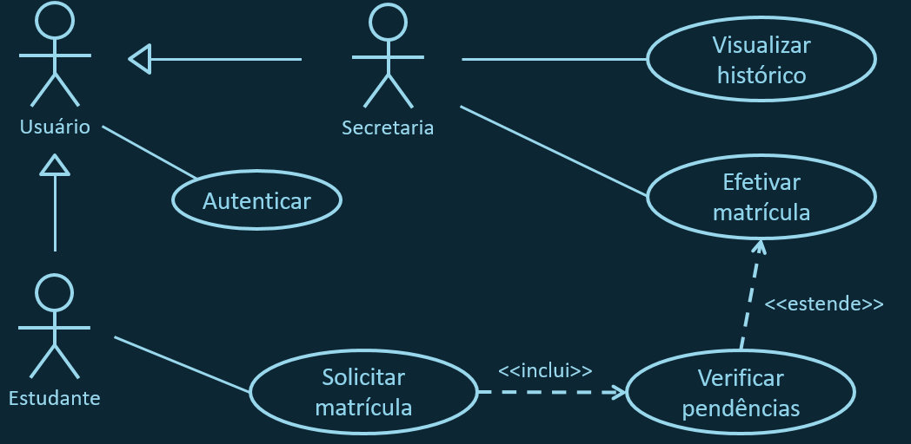

# ANÁLISE E PROJETO DE SISTEMAS
## Aula 8
#### Felipe Marx Benghi
Descrição de Casos de Uso
fbenghi@up.edu.com
https://github.com/fbenghi/AnaliseProjetos2024-1

---

# Objetivos
* Revisão de Diagramas Casos de Uso (UML)
* Descrição de Casos de Uso

---

---

---
## Revisão geral 
### Casos de uso
* Caso (ou situação) que cumpre um ou mais requisitos de funcionais
* Algo que fornece algum resultado mensurável para o usuário ou um sistema externo
* Casos de uso descrevem um sistema de fora para dentro: Especificam o valor que o sistema entrega ao usuário

---
## Revisão geral 
### Atores
* Interagem com o seu sistema, mas funcionam como uma caixa-preta (você não pode modificá-los e não quer saber como funcionam)
* Não precisam ser pessoas

### Linhas de comunicação
* Mostram que o ator está envolvido com o caso de uso

---
## Problemas do Diagrama de Casos de Uso
Um diagrama mostrando todos os casos de uso e atores pode ser um bom ponto de início mas isso não fornece detalhes. Por exemplo:
* Qual(is) o(s) ator(es) principal(is)?
* Quais etapas estão envolvidas?

Normalmente se oferece uma descrição em conjunto com o diagrama
Não existe um modelo universal (UML) para a descrição;

---
Olhar documentos em anexo. 

---
# FIM