# ANÁLISE E PROJETO DE SISTEMAS
## Aula 9
#### Felipe Marx Benghi
Modelagem Orientada a Objetos
fbenghi@up.edu.com
https://github.com/fbenghi/AnaliseProjetos2024-1

---

# Objetivos
* Conceitos da Modelagem a Objetos
* Diagrama de Classes

---
## Modelagem orientada a objetos
A modelagem de um sistema orientado a objetos consiste:
* Na análise do domínio da aplicação;
* Modelagem das entidades;
* Modelagem dos fenômenos do domínio.

Esta tarefa envolve basicamente dois mecanismos:
1. Abstração;
1. Representação (diagrama UML).

---
## Modelagem conceitual
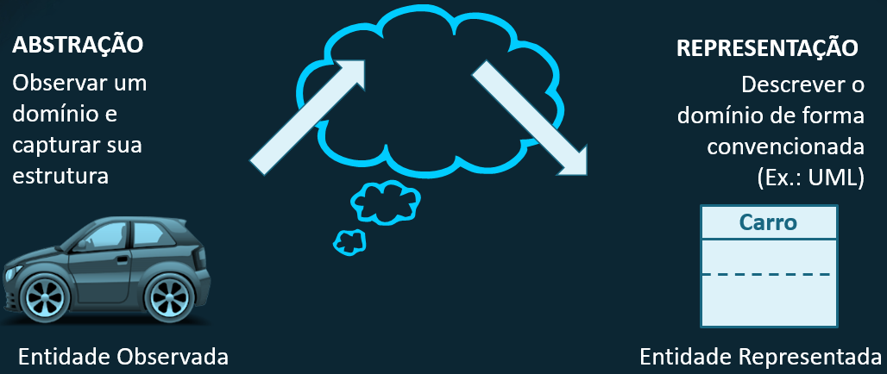

---
# Representação
## Classe
> Uma classe representa um conceito distinto dentro da aplicação que está sendo modelada, representando coisas de um tipo específico – um elemento físico (como um avião), um elemento negocial (como um pedido), [...], um elemento de aplicativo (como um botão) [...]. A classe é a descrição para um conjunto de objetos com estrutura, comportamento e relacionamentos similares.”
(BOOCH et al, 2004, p. 50)

---
Quais classes você identifica nessa figura?

---
Quais classes você identifica nessa figura?

---
## Classe vs Objetos

Classe é uma definição abstrata de um **tipo** composto;
* permite a inserção de tipos heterogêneos de dados e as funcionalidades estão subordinadas a esse tipo.

Objeto é a instância de uma classe.

---
## Estrutura da classe
* Nome: identificador único da classe
* Atributos: características da classe (variáveis de classe)
* Métodos: funcionalidades (operações) da classe

---
## Classe (Representação UML)

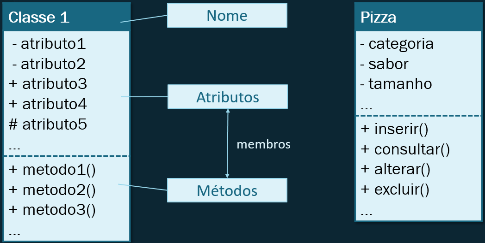

---
## Diagrama de classes
É a representação gráfica das estruturas, comportamentos e relacionamentos entre as classes de um sistema:

---
## Relacionamentos entre classes

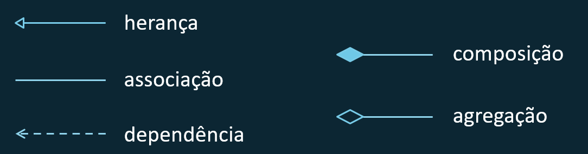

---
## Relacionamento: Herança
Relação de generalização/especialização.
Um coordenador é um tipo específico de professor

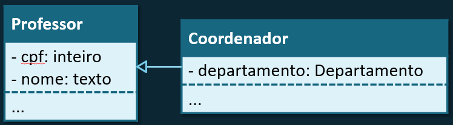

O coordenador, que neste caso é a classe derivada, irá herdar todos os membros do professor, que é a classe base.

---
## Relacionamento: Associação
Indica que uma classe está relacionada a outra, que há uma relação estrutural entre elas.
Uma classe irá `conhecer` a outra na forma de um atributo.
Termo genérico para o relacionamento entre classes (associação e agregação são tipos de associação)

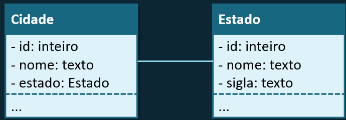

---
## Relacionamento: Composição

* Indica que um elemento é formado de menores componentes
* Um `componente` não pode fazer parte de mais de uma composição

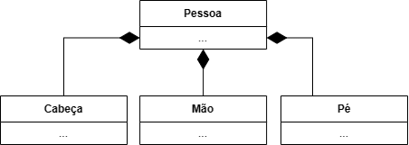

---
## Relacionamento: Composição

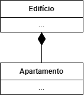

* O todo determina o ciclo de vida das partes (dependência existencial):
    * Se uma composição é apagada, todas as suas partes são apagadas
    * Uma parte pode ser removida sem que a composição tenha que ser apagada completamente

---
## Relacionamento: Agregação
Uma classe faz parte de outra, porém sem dependência existência (a parte pode existir sem o todo). 

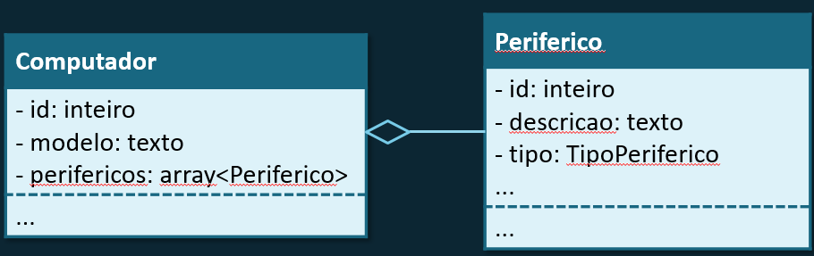
Ex.: um computador agrega vários periféricos.

---
## Relacionamento: Agregação
* Relacionamento mais fraco que Composição
* Tanto time quanto jogador tem seu ciclo de vida independentemente do outro.

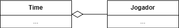

---
## Relacionamento: Dependência
Relacionamento de utilização: uma classe precisa saber sobre a outra para `utilizar` os objetos da outra classe.

Alterações na especificação de um tipo poderão afetar o outro. 

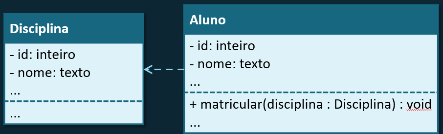

Ex.: matricular um aluno em uma disciplina

---
Resumo de Relacionamentos
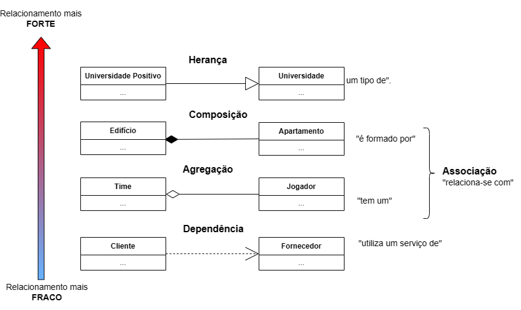

---
## Multiplicidade
Indicação de quantos objetos podem participar de um determinado relacionamento ou o número permitido de instâncias do elemento.

Definida colocando-se o número mínimo e máximo de participações na relação:
* [0..1] (mínimo zero e máximo um), também indicado como [1]
* [1..5] (mínimo um e máximo cinco)
* [0..*] (mínimo zero e máximo infinito)

---
## Multiplicidade
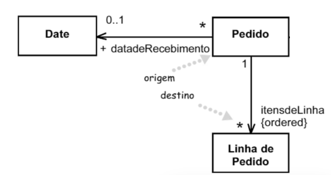

---
Exemplo: pizzaria

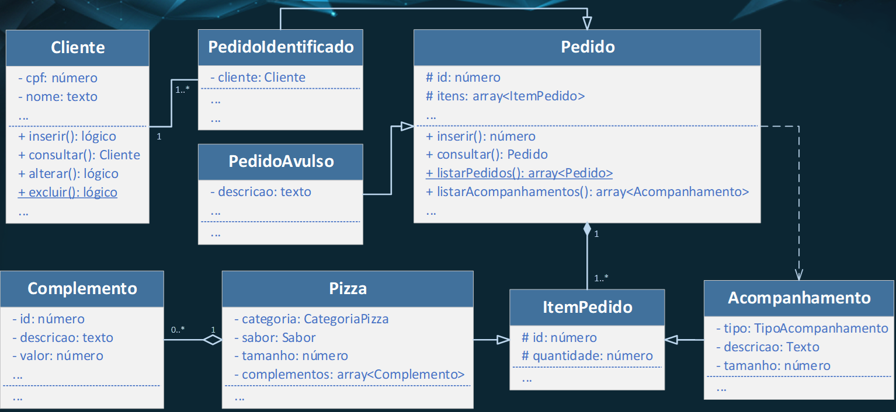

---

# FIM